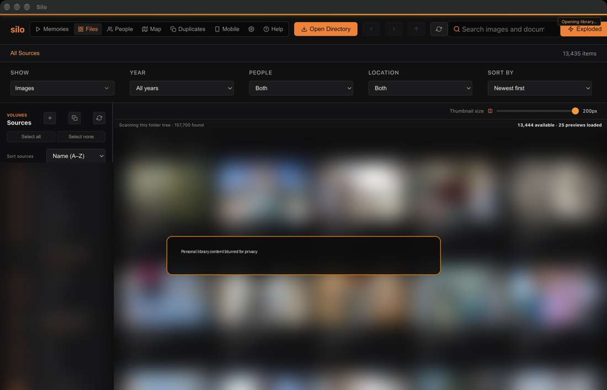

# Install and first launch

## Before you start

Silo is a desktop app for organizing files you already control. Start with one folder or drive, let its inventory settle, and then add optional analysis such as face scanning. On a very large library, the first scan can use noticeable CPU and disk bandwidth.

Use the Silo download that matches your Mac's processor (Apple silicon or Intel). Verify the published SHA-256 checksum before opening an unsigned preview build. If macOS says the app is damaged or will damage your computer, stop, re-download from the official release source and verify the checksum; do not bypass that warning.

Preview builds may be unsigned and not notarized. If Gatekeeper blocks a checksum-verified official build, try opening it once, then use **System Settings → Privacy & Security → Open Anyway** for Silo. Only do this for a build obtained from the official Silo download page.

## First launch, step by step

1. Open Silo. The **Files** section is the library workspace. At first it may be empty.
2. Select **Open Directory** or the **+** beside Sources and choose a folder you want to browse.
3. Grant macOS access when asked. Add other folders or mounted drives one at a time so you can tell which source is being indexed.
4. Watch **Library indexing** in the sidebar. File discovery, search indexing, face analysis, location reading, duplicate checking, audio inventory and thumbnails have separate progress.
5. Open a source from its row, or select several sources and browse them together.
6. Enter an ordinary-language description in the search field after the search index reports ready. Refine the results with the file type, year, people and location filters.
7. Open **Settings** to choose the appearance, review storage destinations, and read the privacy controls before connecting cloud services or sharing a library.

## Where to go next

- Learn the [Files toolbar and source list](01-files-and-sources.md).
- See what the [indexing stages mean](02-search-and-indexing.md).
- Add [people and face groups](03-people.md) when you are ready; that scan is optional and separate.
- Set up [phone](08-mobile.md) or [Google](09-cloud-sources.md) sources only when you need them.

## A note about first-run speed

The first launch can reopen saved records, warm the local search model and prepare a fast search structure. These are not the same as discovering every file on every connected source. A saved library can appear while new-source discovery continues, and search coverage grows as eligible files are indexed. Silo does not promise a fixed completion time; library size, file formats, storage speed, source availability and Mac hardware all matter.

If the Mac becomes uncomfortably warm or sluggish, pause an active **People** scan from that page or quit Silo to stop its background work. Search/index progress already saved locally is retained; unfinished work may resume on the next launch. Do not keep several heavyweight scans running just to make every progress bar advance at once.
