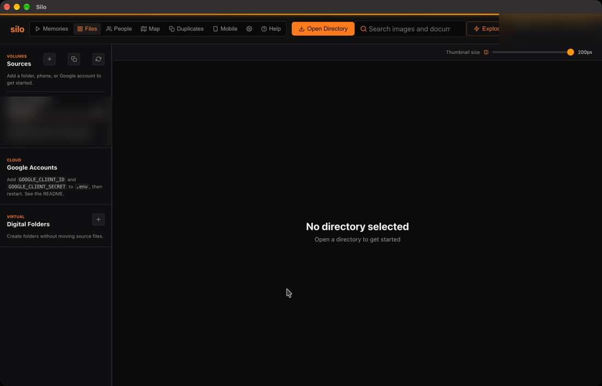

# Silo User Guide

**Your files, one local-first library.** Browse folders, drives, connected phones and selected cloud files; search photos by meaning; organize with people, places and virtual collections; review duplicates; and make memory videos.

> This guide describes the Silo 2.0.2 source snapshot reviewed on **October 9, 2026**. The installed Mac app used for screenshots currently reports bundle version **1.0.0** and minimum macOS **12.0**, so the source and packaged version labels do not agree. See [Compatibility and known limits](13-compatibility.md) before relying on version-specific details.

## Start here

1. [Install and take the first tour](00-getting-started.md)
2. [Add a folder and learn the Files workspace](01-files-and-sources.md)
3. [Understand indexing and semantic search](02-search-and-indexing.md)
4. [Choose the feature you need](#guide)

## Guide

- [People and face scanning](03-people.md)
- [Digital folders and offline references](04-digital-folders.md)
- [Map and photo locations](05-map.md)
- [Duplicates and safe review](06-duplicates.md)
- [Memories and story videos](07-memories.md)
- [Phones, backups and messages](08-mobile.md)
- [Google Drive and Google Photos](09-cloud-sources.md)
- [Shelter copies and Time Machine](10-backups.md)
- [Settings, storage and privacy](11-settings-and-privacy.md)
- [Troubleshooting](12-troubleshooting.md)
- [Compatibility and known limits](13-compatibility.md)
- [License, demo and support access](14-license-and-demo.md)

## What Silo does

Silo presents selected sources in a unified desktop workspace. It keeps original files where they are unless you choose an action that changes them. Search indexes, face groups, location indexes, thumbnails and other derived data are local Silo data; they are not substitutes for a backup of your originals.

Most first-run tasks take time on a large library. Finding files, preparing CLIP search, face scanning, location extraction, duplicate hashing and thumbnail generation are separate jobs. A progress bar reaching 100% for one job does not mean every other job is complete.

## Privacy at a glance

- Local folders are processed on the Mac. CLIP search and face detection use local models after the required model files are available.
- Google Drive and Google Photos require online Google access. Google Photos is limited to items you explicitly choose through Google Photos Picker.
- Phone browsing needs the phone connected and trusted. Silo fetches a remote phone file when you open or export it.
- A Silo library share allows people with its link on the same trusted Wi-Fi network to browse, search, preview and download the included media. It uses unencrypted local HTTP.
- Configuration exports can contain sign-in tokens. Keep them private.

## Silo look and feel

The guide uses Silo's black and orange identity. GitBook's built-in theme follows the reader's light or dark preference; use the Silo logo and orange accent in the space branding controls. Do not force dark body text onto a light theme.
